::: {.callout-note}
## About this document

Reconstructed from the audio recording of the September 3, 2026 lab meeting, the 23 photos I took of the instruments during the walkthrough, and follow-up research on the group's recent publications. Apurva led the tour; a second lab member (working on optical computing) joined for the discussion of on-chip heaters and MZI meshes. The transcript was cleaned up for readability; the content and order are faithful to what was said. Photos are embedded next to the instrument or topic they show.

:::

# The big picture: laser, sample, detector

Apurva's framing for the entire lab, stated at the top of the meeting:

> "You can break down every single experiment that we do into three parts: **laser, sample, detector**. Types of lasers change, types of detectors change, types of samples change — but every measurement is completely the same: you control the laser and you control the detector."

Everything else in the walkthrough hangs off this skeleton:

- **Laser (input side):** choose a light source, condition it (power, polarization, pulsing), and couple it into the chip.
- **Sample:** the photonic chip — a nonlinear medium hosting the microring lattices — sitting under a microscope on precision translation stages, with on-chip heaters as the tuning knobs.
- **Detector (output side):** collect what comes out of the chip and route it to whichever measurement instrument answers the question at hand — total power, optical spectrum (coarse or ultra-fine), visible-band spectrum, time-domain waveform, or electronic (RF) spectrum.

# The input side: lasers and amplifiers

## The laser inventory

The lab has several classes of source, and which one you use depends on the experiment:

- **Low-power continuous-wave (CW), low-noise laser** — the workhorse tunable laser (Santec; its function generator on the rack still carries the Santec label tape). Wavelength and current are set from the PC over its serial/software interface.
- **Pulsed fiber laser** — the **BKtel** unit ("BKtel 2", type `CPFL-1550-300a-FCAPC`, a 1550 nm, 300 mW-class pulsed fiber laser, manufactured 01/2024). In lab shorthand this is "the big laser" — the `bkTel_*` control scripts on the shared drive are named after it.
- **Fiber amplifiers (EDFAs)** — several erbium-doped fiber amplifiers boost the seed laser to the powers needed for nonlinear experiments: the BKtel module, an **Optilab** benchtop EDFA (with `INPUT`, `1% TAP`, and `OUTPUT` fiber ports — the 1% tap lets you monitor what is being amplified), and a rack-mount **FTTP EDFA** (LAN-connected, with PUMP/INPUT/ALARM status LEDs).
- **Optical vector network analyzer** — the **Luna OVA** on the other bench, itself containing a swept laser; used for phase/group-delay/transmission characterization of devices.

{width=70%}

{width=70%}

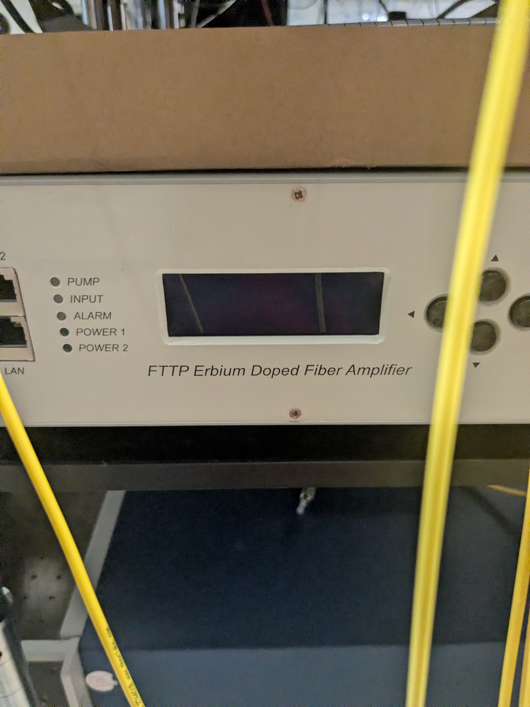{width=70%}

**Why the amplifiers are *not* worth automating:** the EDFAs just amplify whatever seed laser you feed them. You control the output wavelength and modulation by controlling the *seed* laser, so remote-controlling the amplifier itself adds nothing. This is why Apurva put "fiber amplifiers" at the bottom of the automation priority list.

## How you talk to a laser: the trigger chain

Different lasers have different trigger requirements. For the pulsed BKtel laser the control is split between *hardware* and *software* channels:

- **Hardware trigger:** a **Rigol DG4202 function/arbitrary waveform generator** sends a square wave at the desired repetition rate (it was set to 250 kHz, ~5 V high level during the demo). The laser fires a pulse on each rising edge. A **Tektronix TDS 2014 oscilloscope** (100 MHz, 1 GS/s) sits next to it to verify the trigger waveform — the demo showed the same 250.003 kHz square wave on channel 1.
- **Software control:** wavelength, current, and other slow parameters go over the serial/USB link from the PC, using the vendor's command set.

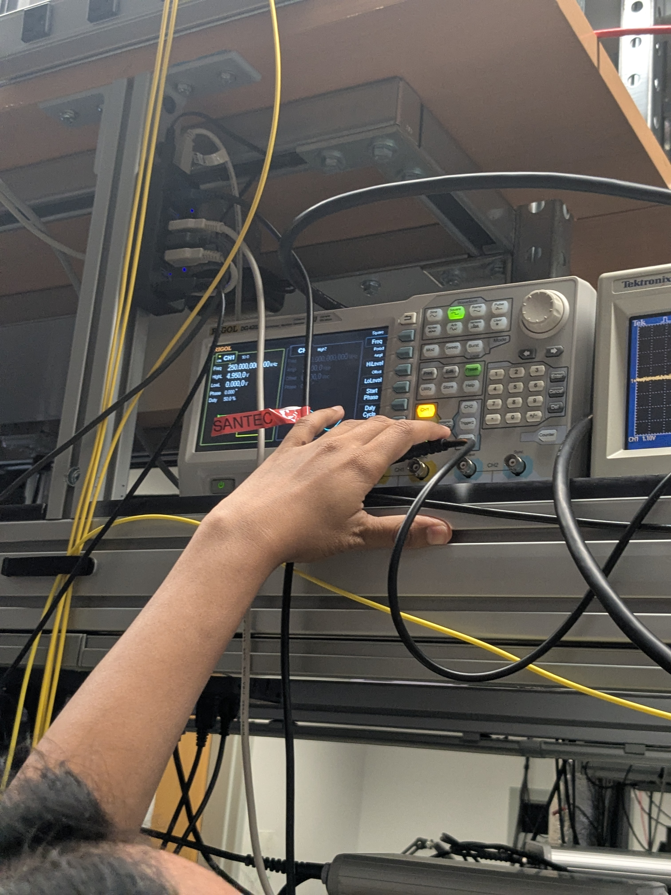{width=70%}

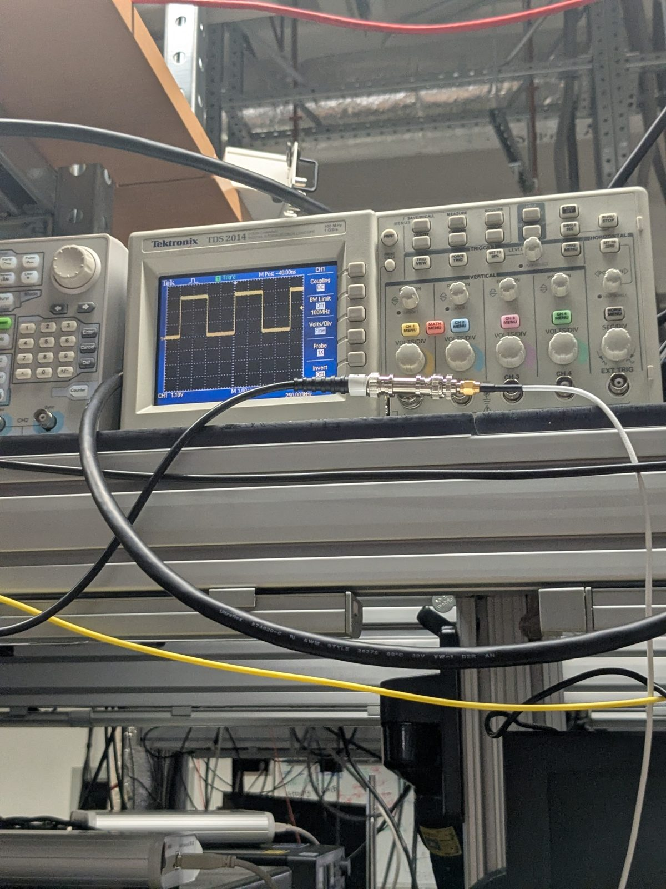{width=70%}

There are also **higher-bandwidth signal generators** that are mostly not in use yet (Gavin has started using them) — most notably the **Zurich Instruments SHFSG 8.5 GHz, 8-channel signal generator**, which belongs to the fully-automated-setup plans.

{width=70%}

## Power control and laser safety

- **Motorized attenuator wheel:** a motor (connected to the PC) rotates a disc that is a **transmission gradient** — parts transparent, parts opaque. As the motor rotates the disc, the beam hits regions of different transmissivity, which sets how much power continues down the line. Calibration data for it lives in the `Wheel_calibration` folder on the lab PC. Power is monitored with **power sensors/meters** at various points.
- **Physical laser blocks:** flip-style beam blocks sit in the free-space path. For high-power measurements these are the safety of last resort — if something goes wrong you just flip the block closed. Apurva flagged this as a genuine **constraint on full automation**: safety interlocks are physical, and any automated system has to respect that.

{width=80%}

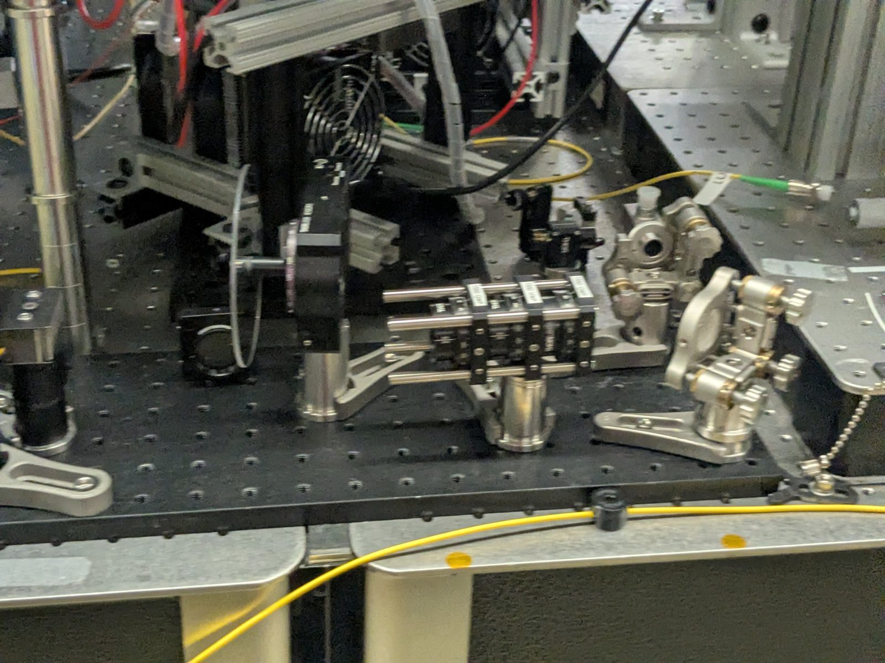{width=80%}

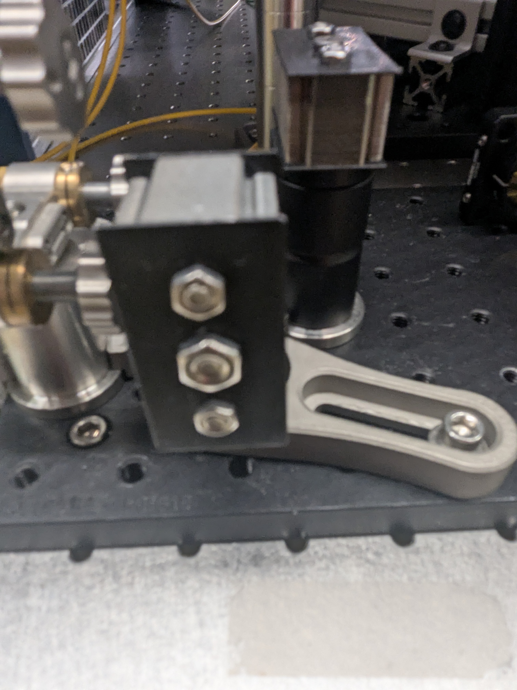{width=60%}

# The sample: chip, stages, and imaging

## The microscope and cameras

The chip is imaged from above through a vertical microscope column — a **Navitar 12× zoom** body with an **AmScope camera** on top (and a Thorlabs **CS165CU Zelux** color CMOS camera in the imaging path, whose live-view software runs on the lab PC). A beamsplitter in the column feeds **two cameras**. The imaging serves two purposes: seeing where the fiber is relative to the chip facet during alignment, and reading the labels etched next to each device's waveguide ports. The camera itself sits on a translation stage, so **the camera can move around the chip** — a key ingredient of the automated-characterization vision.

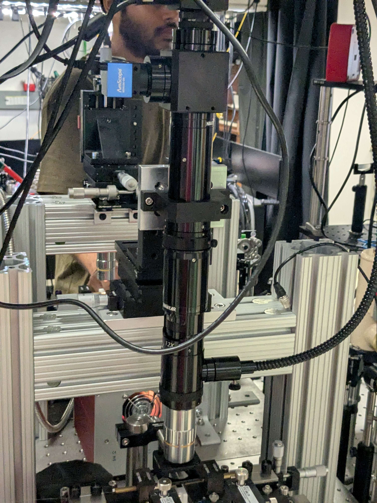{width=65%}

{width=75%}

## Translation stages: manual, motorized, and piezo

Fiber-to-chip coupling is currently a **manual** process: you turn micrometer knobs while watching the microscope camera. It also **drifts during experiments** — at high input power the fiber undergoes thermal vibrations/expansion, so coupling has to be re-optimized by hand. The stage inventory is the path out of this:

- **Thorlabs NanoMax-TS 3-axis flexure stages** — the "fancy stages." Manual micrometers on X/Y/Z that **can be swapped for stepper motors**, plus internal **piezo actuators** (the SMA-connector cables labeled 1/2/3 and D-sub feedback connectors) for closed-loop control with **~20 µm fine range**. These are ultra-precise but short-range.
- **Elliot Scientific (Martock Design) 3-axis flexure stage** — same class of ultra-fine manual flexure stage, on the second setup.
- **Newport CONEX-CC DC servo controller/driver** — a USB-connected closed-loop servo controller (24 V) with a motorized actuator (M8127D0-labeled cable), for motorized axes with longer travel.
- Assorted **Newport micrometer stages** under the microscope column.

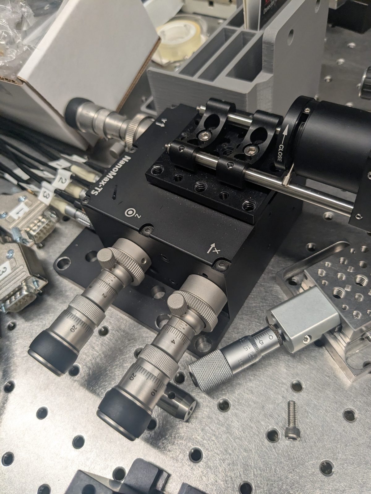{width=70%}

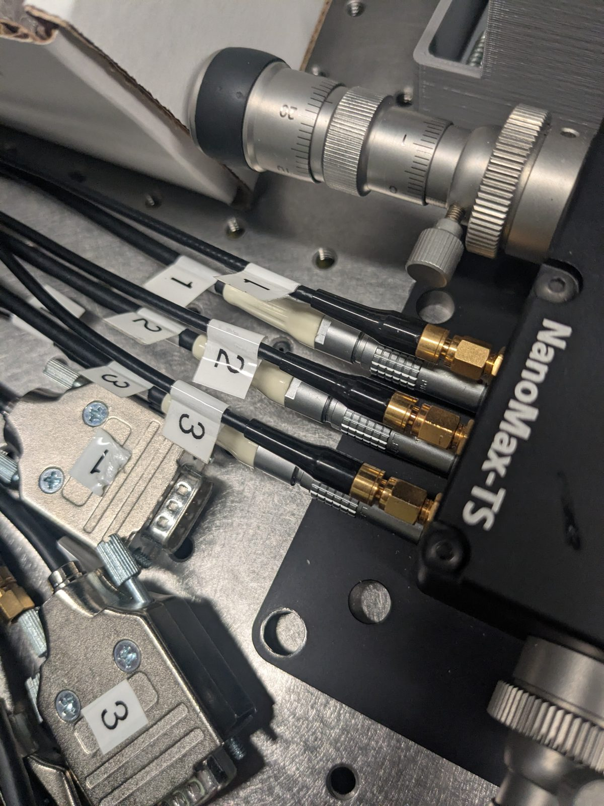{width=70%}

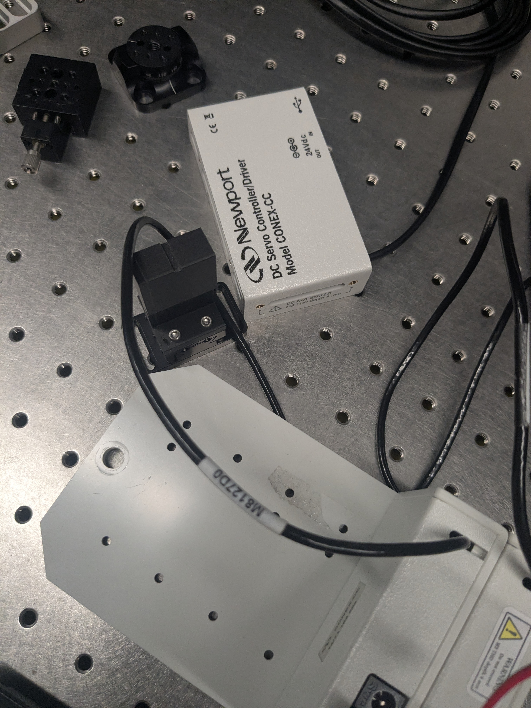{width=70%}

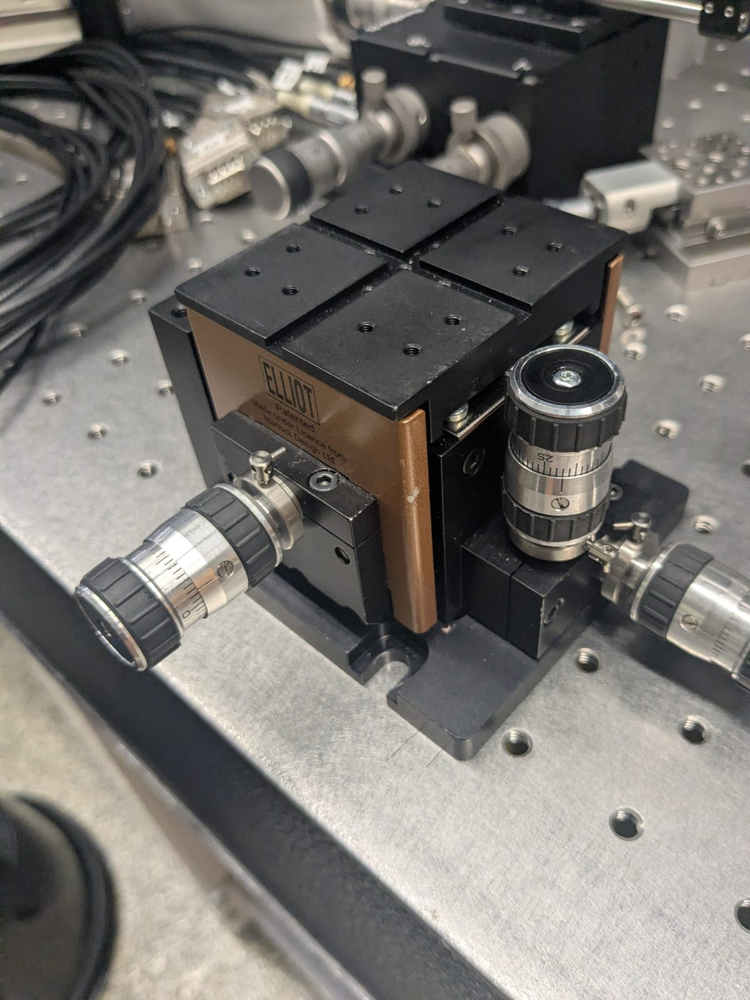{width=70%}

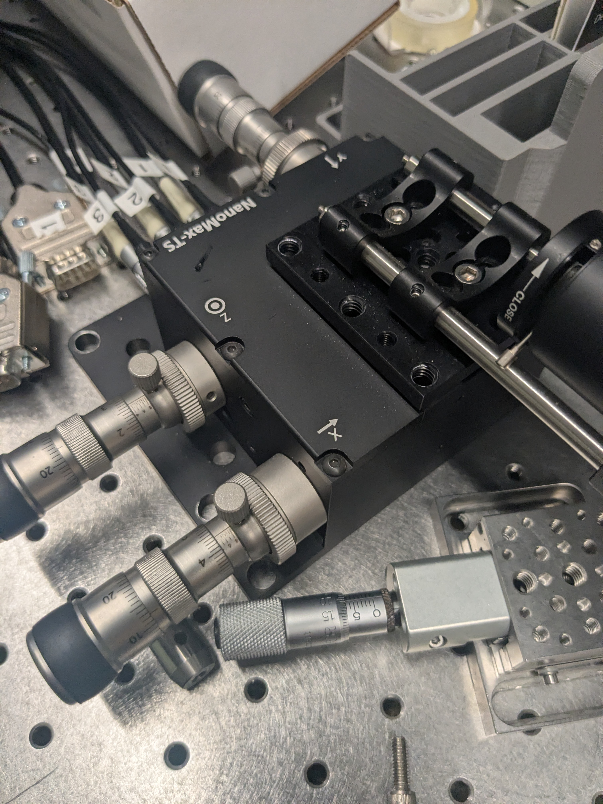{width=70%}

**The range-of-motion constraint:** the piezo fine range is only ~20 µm, and the manual micrometer travel is limited. Moving between *different devices/ports* on a chip is a long-range move. The plan discussed at the end of the meeting: replace the manual micrometers with **longer-range motorized actuators** so the stage can (1) do coarse port-to-port moves, then (2) hand off to the piezos for automated fine alignment. As one lab member put it: merely auto-optimizing alignment at one port "is not that interesting in itself" — the win is **long-range changes between different ports**, i.e., "align to device 21" as a single command.

## On-chip heaters

Asked why the lab "bought" heaters: they aren't bought — **they are fabricated on the chip**. A heater is a very thin metal wire next to/above a waveguide:

- Current through the thin wire dissipates heat (Joule heating), warming the material around it.
- The temperature change shifts the **refractive index** of the waveguide region, which changes the **optical path length** — and also modifies the local **nonlinear properties**.
- Heaters are therefore the **easiest and most mature way to control anything on-chip**.

Two uses were emphasized:

1. **Calibration / trimming.** Fabrication is never ideal (thickness variations, roughness). Example: an interferometer designed for a 50–50 split comes back with a random extra phase in one arm. Rather than throwing the chip out, you tune the heater until the device behaves like the ideal design.
2. **Optical computing.** In Mach–Zehnder interferometer (MZI) meshes — still the only fully on-chip approach to optical computing — the **optical weights are encoded entirely with heaters**. This drew the comparison discussion: reprogrammable photonics is not beating FPGAs on energy/reconfigurability yet, and the goal is to find where these systems are genuinely useful, which may be something an FPGA is fundamentally bad at.

The **Keithley 2220-30-1 dual-channel DC power supply** (2 × 30 V / 1.5 A, fully programmable) is the kind of current source used to drive heaters.

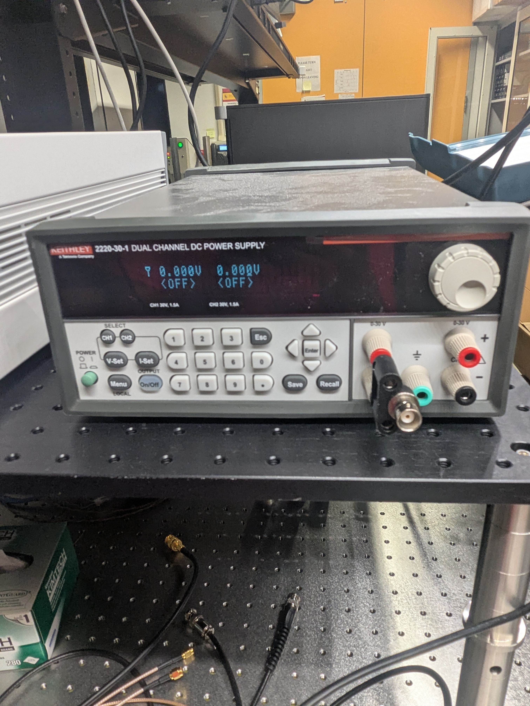{width=70%}

# The output side: detectors and analyzers

## Optical-domain measurements

Light comes out of the chip and is routed by fiber to one of several instruments, in increasing order of spectral specificity:

1. **Power sensor / power meter** — "tell me how much power is there." The simplest transmission measurement.
2. **Yokogawa AQ6375B optical spectrum analyzer (OSA), 1200–2400 nm** — the workhorse spectrum measurement. Internally it is a **grating** instrument: the grating sends different wavelengths to different angles, and a strip sensor correlates angle to wavelength. The grating + detector combination is exactly what sets the instrument's usable wavelength range.
3. **APEX OSA-APE high-resolution OSA** — "works very differently, but does the same thing," with far finer resolution. Internally it has **its own tunable laser that sweeps and beats against your signal** (heterodyne detection); the resolution and range are set by that internal optical design. Used when comb line shapes or narrow features matter.
4. **Visible-band spectrometer + TE-cooled camera** — the OSAs stop at 1200 nm. Signals at 775 nm (second harmonic of 1550 nm) or ~500 nm land on a long free-space **spectrometer** with interchangeable gratings, feeding a **thermo-electrically cooled Princeton Instruments camera**: cooling lowers the dark noise, making it far more sensitive. This is the red/green-light instrument. (The `Lightfield_*` scripts on the shared drive talk to its LightField software; a Princeton Instruments unit sits by the attocube attoDRY cryostat.)

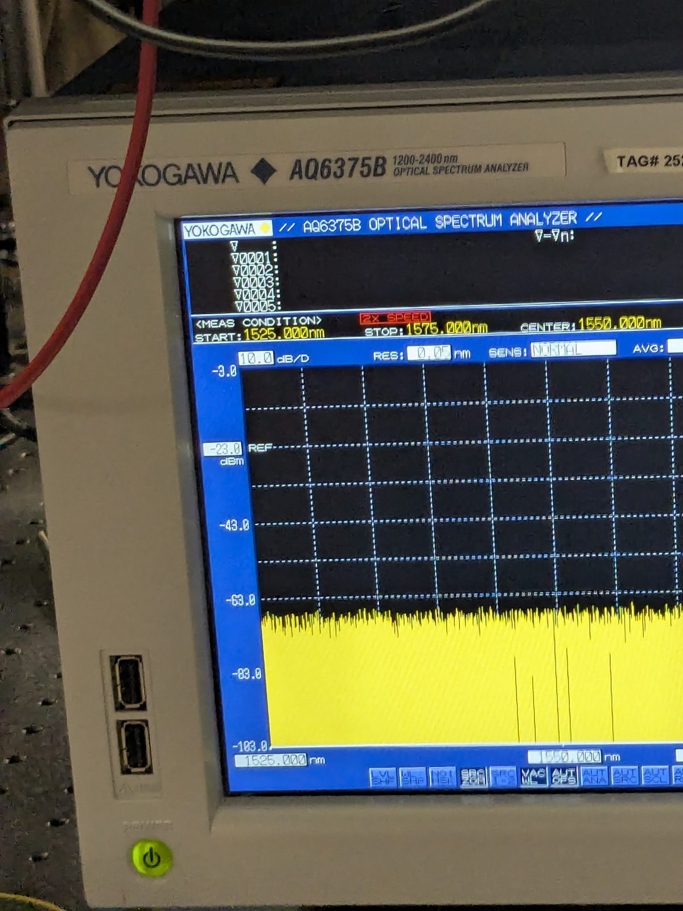{width=70%}

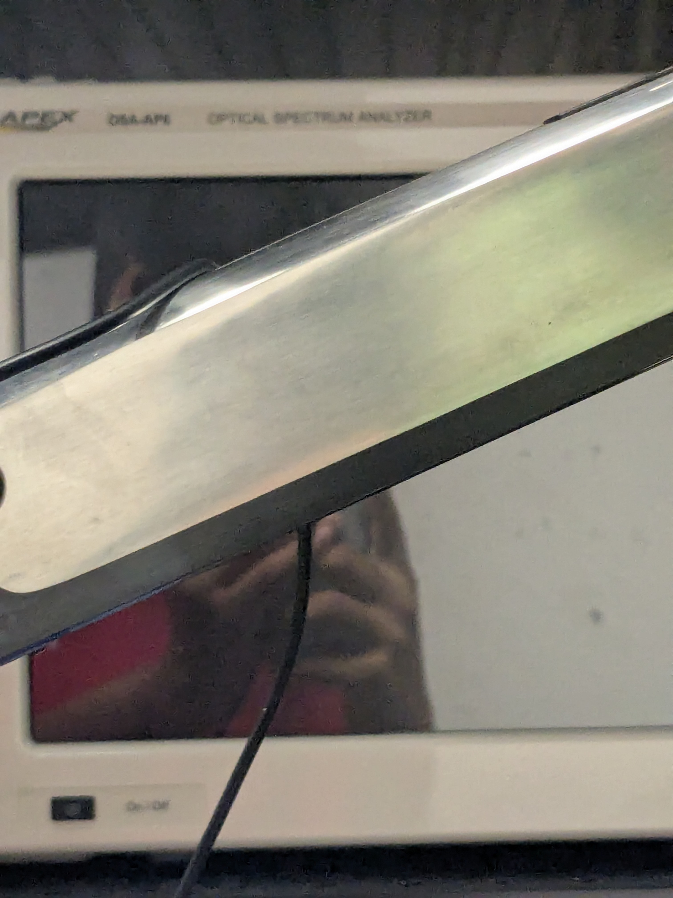{width=60%}

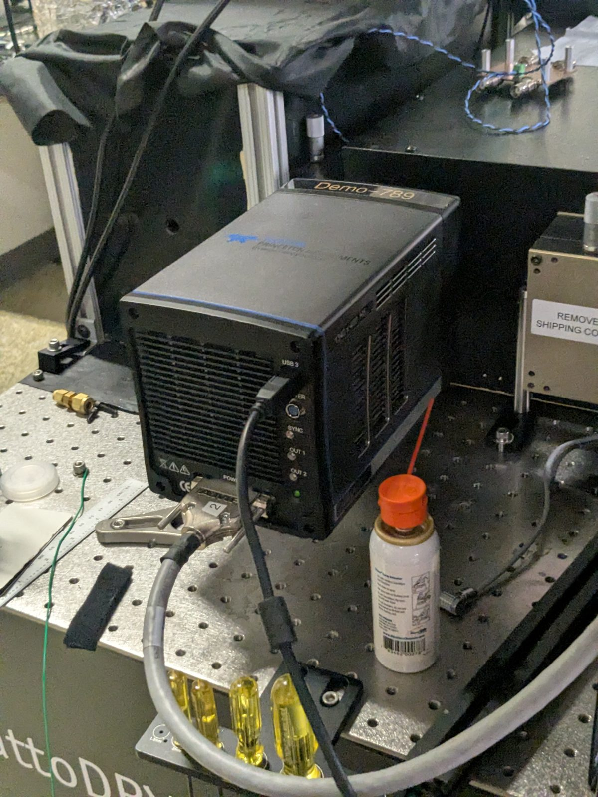{width=70%}

**Why one instrument can't cover everything (my question, answered):** I asked why the range limit is a property of the spectrum analyzer and not the fiber. Answer: fibers do matter — a larger core supports shorter wavelengths, and a small core can't support much longer wavelengths, so 1550 nm fiber passes some red/green light inefficiently but usably — yet the *hard* limit is the instrument's internal optics: which grating it has and which detector material reads it out.

## Electronic-domain measurements

To see anything in real time (pulses, laser noise), light must become an electronic signal first:

- **Photodetector:** incident photons are converted to a photocurrent. What matters is not latency per se but the detector's **bandwidth** — for CW measurements bandwidth is irrelevant, but to resolve fast pulses the detector must be faster than the pulse. (My latency question, answered: latency only becomes an issue when you must **synchronize multiple signals or instruments**, in which case relative timing matters.)
- **DAC/DAQ box:** digitizes the detector output and streams it to the PC (this is the "DAC" in the notes — it also exchanges hardware-level trigger signals with the laser, so instruments talk to each other *both* through the PC and directly in hardware).
- **Oscilloscope** — time-domain view. The Tektronix TDS 2014 is the everyday scope; a **Tektronix DSA72004B Digital Serial Analyzer (20 GHz, 50 GS/s)** handles fast-signal work.
- **Electronic spectrum analyzer (ESA)** — frequency-domain view of the photocurrent, e.g., for repetition-rate beat notes and laser noise. The **Rohde & Schwarz FPL (5 kHz–14 GHz)** spectrum analyzer is the current ESA.

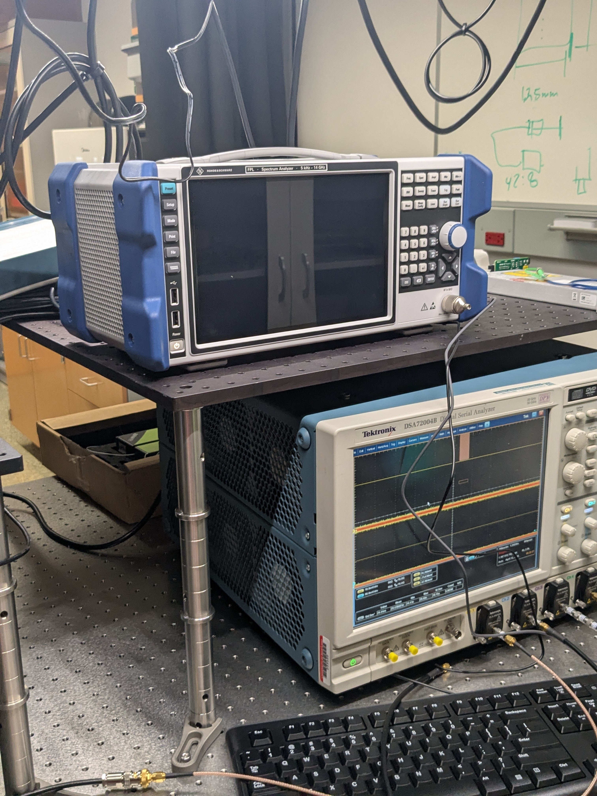{width=70%}

# How everything talks: the control architecture

## The serial backbone

- Nearly every instrument is connected to the lab PC **individually**, mostly over **serial** (RS-232/USB-serial) through a **many-to-one USB hub** mounted under the shelf; some instruments (rack EDFA, OSA) also have LAN.
- Instruments *also* talk to each other **directly in hardware** — trigger lines between the function generator, laser, DAC, and scopes — independent of the PC.
- Every commercial instrument ships with either vendor software or a **programming manual**: a list of commands (SCPI-style) you can send over the link. "You can write a program to communicate with the laser."
- You can **ping** each instrument to verify it is connected — the basis for a connection-status dashboard.

**Connected right now** (as enumerated during the meeting): the DAC, the (Santec CW) laser, the power meter, BKtel 2, the Thorlabs motor (attenuator wheel), and the Yokogawa OSA. **Connected per-workflow:** oscilloscope, ESA, the cameras, the spectrometer, and other lasers such as the Luna OVA. **Not yet remote-controlled:** the amplifiers (deliberately — see above) and some of the newer instruments.

## The existing code base

The shared Google Drive (`CMNS-phys-hafezi-lab → 01 User Accounts → Apurva → A - Lab stuff - instruments`) holds the current automation scripts — "very old" codes, many written by Chris (a former student) **before AI**, in many near-duplicate versions per instrument combination:

`ApexTest`, `bkTel_DAQ_OSA_ESA_APEX_OptoPlex_Control`, `bkTel_DAQ_OSA_ESA_OptoPlex_Control`, `bkTel_NewportDAQ_OSA_Control`, `bkTel_NewportDAQ_OSA_OptoPlex_Control`, `bkTel_OSA_Control`, `bkTel_Pylon_NewportDAQ_OSA_MFLI_Control`, `bkTel_Pylon_NewportDAQ_OSA_OptoPlex_Control`, `bkTel_SerialScript`, `CF_bkTel_stability_script`, `ESA_AUTOMATION_SCRIPT`, `ESA_data_acq`, `Lightfield_Read_NPZ`, `LightfieldTester`, `OptoPlexTester`, `ProcessbktelSweep`, `ProcessMFLIandSpec`, `quickplot`, `ReadLumericalModeProfile`, `readNPZ`, `ReadThermalSweep`, `Santec_Nidaq_GUI3`, `Scope_data_acq`, `Synchronous_Acquisition`, `TeraTermTest`, `Yokogawa_Interface`, `ZH_DAQ_FFT`, `ZH_Scope_Test_Script`.

The file names read as a map of the hardware: each script hard-wires one *combination* of instruments (BKtel laser + DAQ + OSA + ESA + APEX + OptoPlex …). They are "kind of sufficient," but the wish is explicit:

> "It would be nice to have all of them in one program — an interface where you can control everything at once, making sure things work perfectly and the safety is very certain."

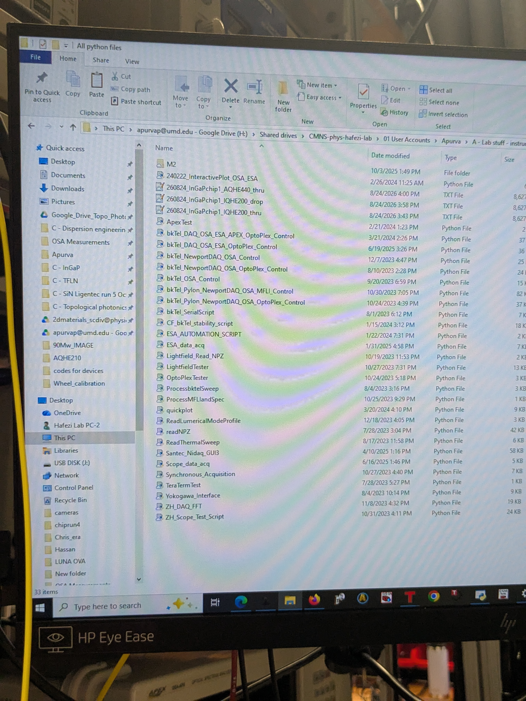{width=75%}

## Architecture discussion (my questions)

- *Centralized vs. distributed?* I asked whether the unified interface should be one worker that all machines talk to (an API service) or distributed per-computer processes. The scope matters: for lab control and calibration there is **no heavy compute requirement**, so architecture is driven by connectivity, not throughput. Since all instruments already funnel over serial into (mostly) one PC, a single controller process with a well-defined instrument-driver layer is the natural starting point.
- *Scope of "everything"?* Clarified: **all the instruments**, not just the existing scripts — with the workflow layer on top: "you have so many different instruments, and your workflow depends on the kind of experiment you're doing. It would be nice to have all the instruments talk to whatever computer they're connected to, and then a way to just **select the kind of workflow** that I want."
- *Master cable?* There is no single hardware bus — it's a many-to-one USB/serial adapter into the PC, plus point-to-point hardware trigger lines. Any design must accommodate both software commands and hardware-timed signals.

# The lab's design-to-measurement workflow

## From theory to chip to data

The full loop, as Apurva laid it out (with the caveat that it is **not** a continuous, closed workflow — it's iterative, with humans in the loop):

1. **Theory / simulation.** The chip hosts a nonlinear medium; the lattice is designed to realize a target **Hamiltonian** (from nonlinear optics / topology). Lida does most of the simulation: solving the **nonlinear Schrödinger equation** (and related coupled-mode equations) for light propagating through the device. The simulations yield a set of **design parameters**.
2. **Chip design.** **KLayout** is used *only* for drawing the chip — producing the **GDS** file. The GDS is designed to *mimic* the simulation's parameters (the parameters do not come from the GDS — that was my chicken-and-egg question, answered).
3. **Fabrication.** Sent to a fabricator / cleanroom, whose process constraints feed back into the design ("sometimes it's not just what you want to do — it's constrained by the cleanroom").
4. **Measurement.** To recreate what the simulation predicts: **control the input light → send it into the chip → look at what comes out.** That is the entire experiment, instantiated with the instruments above.
5. **Think, then iterate.** Simulation and experiment never match perfectly. "There are a lot of times where you have to **break the loop** and think about what's happening" — you look at the experiments, look at the simulation, think, and design the next chip. The intellectual work — choosing geometry, adapting designs to a new material whose nonlinear properties differ — takes input from many people, literature, and experience.

Two complementary tasks were named explicitly: **(a)** whatever Lida sees in simulation that is interesting — replicate it in the lab; **(b)** whatever the lab produces — model it in theory. It goes both ways.

## Lida's simulation tool, and a possible integration

Lida has software where you **feed in the design parameters** (the gaps in the design, the losses, etc.) and it **outputs the predicted spectrum** — the frequency comb spectrum, or the lattice transmission. When Apurva measures a device she roughly knows its parameters, so a side-by-side of *predicted vs. measured* spectra inside the measurement interface "would be nice, maybe, in some way" — though how much sense full integration makes is an open question. Whether the tool ingests the GDS/KLayout design directly is unknown — that's a question for Lida.

**Logistics:** the group is sitting down together **next week** to learn Lida's simulation tool; I asked to join and Apurva agreed to keep me posted.

## Classical rings, quantum analogies

A clarification from the optical-computing lab member, prompted by my qubit question: the microring-lattice system is **not quantum** — the rings are visible by eye. It is an **analogy** to the quantum Hall effect: the lattice Hamiltonian mimics the physics of electrons circling in a magnetic field, simulated with light in a nice, cool, controllable system. Genuine **topological qubits** are a different thing entirely (real electrons in 2D/solid-state materials). And on reprogrammability: on-chip photonics is not beating FPGAs in energy scaling yet — the goal is to do something *useful*, possibly something FPGAs are inherently bad at.

This matches the group's published program: the [topological frequency comb work (Science 2024)](https://hafezi.jqi.umd.edu/news/new-photonic-chip-spawns-nested-topological-frequency-comb) and the 2026 [topological second-harmonic generation in an 8×8 nonlinear microresonator array](https://www.nature.com/articles/s42005-026-02520-y), on the [InGaP χ⁽²⁾ platform](https://www.nature.com/articles/s41377-024-01653-5) — the lab PC's data files (`InGaP_UCSB_chip1_AQHE401_FR_drop/_thru`) are exactly these anomalous-quantum-Hall-lattice devices.

# Glossary of terms from the meeting

- **OSA** — optical spectrum analyzer (grating-based; spectrum vs. wavelength).
- **ESA** — electronic spectrum analyzer (RF spectrum of a photodetected signal).
- **OVA** — optical vector network analyzer (Luna); amplitude + phase response of a device.
- **EDFA** — erbium-doped fiber amplifier; amplifies a 1550 nm-band seed laser.
- **Seed laser** — the low-power laser whose light an amplifier boosts; controlling it controls the amplified output.
- **DAC/DAQ** — the digitizer box converting detector voltage to digital samples for the PC (Newport/NI hardware in the scripts).
- **TE-cooled camera** — thermo-electrically (Peltier) cooled sensor; lower dark noise, higher sensitivity.
- **Grating** — dispersive element sending different wavelengths at different angles; sets an instrument's wavelength range together with its detector.
- **Heterodyne/beating** — mixing the signal with a swept reference laser; how the APEX OSA achieves very high resolution.
- **GDS** — the chip-layout file format produced via KLayout.
- **Waveguide ports** — the labeled input/output facets of each on-chip device.
- **Heater** — on-chip resistive wire; Joule heating shifts refractive index → phase/nonlinearity tuning.
- **MZI mesh** — Mach–Zehnder interferometer network; heater-controlled weights; the standard on-chip optical-computing architecture.
- **NLSE** — nonlinear Schrödinger equation; governs light in the nonlinear medium; Lida's simulation core.
- **AQHE devices** — the anomalous-quantum-Hall-lattice chips (per the data filenames), classical photonic analogies of the quantum Hall effect.
- **Flexure stage** — monolithic spring-guided translation stage (NanoMax, Elliot); sub-micron precision, small travel.
- **Piezo fine positioning** — ~20 µm range voltage-driven actuation inside the NanoMax stages.

# Looking ahead

- Group session **next week** to learn Lida's simulation software (I asked to join).
- **Two new experimental setups** to be assembled over the next couple of weeks; one is the platform for the automation work. A few purchases (camera, motors) pending.
- Motorized-stage automation targeted for the **next few months**; the unified interface is the agreed near-term starting point.
- Possible **power outage tomorrow** — check before running anything.

