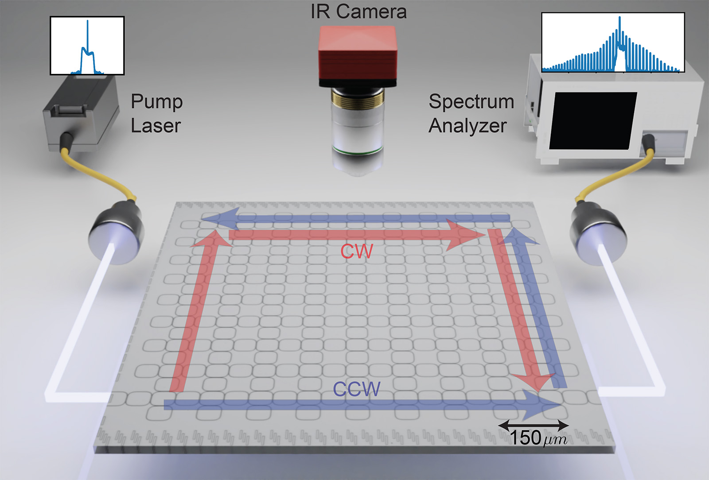

![[assets/news/new-photonic-chip-spawns-nested-topological-frequency-comb.jpg]]

Scientists on the hunt for compact and robust sources of multicolored laser light have generated the first topological frequency comb. [Their result](https://doi.org/10.1126/science.ado0053), which relies on a small silicon nitride chip patterned with hundreds of microscopic rings, will appear in the June 21, 2024 issue of the journal _Science_.

Light from an ordinary laser shines with a single, sharply defined color—or, equivalently, a single frequency. A frequency comb [is like a souped-up laser](https://www.nist.gov/topics/physics/optical-frequency-combs), but instead of emitting a single frequency of light, a frequency comb shines with many pristine, evenly spaced frequency spikes. The even spacing between the spikes resembles the teeth of a comb, which lends the frequency comb its name.

The earliest frequency combs required bulky equipment to create. More recently researchers have been focused on miniaturizing them into integrated, chip-based platforms. Despite big improvements in shrinking the equipment needed to generate frequency combs, the fundamental ideas haven’t changed. Creating a useful frequency comb requires a stable source of light and a way to disperse that light into the teeth of the comb by taking advantage of optical gain, loss and other effects that emerge when the source of light gets more intense.

In the new work, JQI Fellow [Mohammad Hafezi](https://hafezi.jqi.umd.edu), who is also a Minta Martin professor of electrical and computer engineering and physics at the University of Maryland (UMD), JQI Fellow [Kartik Srinivasan](https://srinivasan.jqi.umd.edu), who is also a Fellow of the National Institute of Standards and Technology, and several colleagues have combined two lines of research into a new method for generating frequency combs. One line is attempting to miniaturize the creation of frequency combs [using microscopic resonator rings](https://jqi.umd.edu/news/light-synchronization-technique-heralds-bright-new-chapter-small-atomic-clocks) fabricated out of semiconductors. The second involves topological photonics, which [uses patterns of repeating structures to create pathways for light](https://jqi.umd.edu/news/novel-design-may-boost-efficiency-chip-frequency-combs) that are immune to small imperfections in fabrication.

“The world of frequency combs is exploding in single-ring integrated systems,” says Chris Flower, a graduate student at JQI and the UMD Department of Physics and the lead author of the new paper. “Our idea was essentially, could similar physics be realized in a special lattice of hundreds of coupled rings? It was a pretty major escalation in the complexity of the system.”

By designing a chip with hundreds of resonator rings arranged in a two-dimensional grid, Flower and his colleagues engineered a complex pattern of interference that takes input laser light and circulates it around the edge of the chip while the material of the chip itself splits it up into many frequencies. In the experiment, the researchers took snapshots of the light from above the chip and showed that it was, in fact, circulating around the edge. They also siphoned out some of the light to perform a high-resolution analysis of its frequencies, demonstrating that the circulating light had the structure of a frequency comb twice over. They found one comb with relatively broad teeth and, nestled within each tooth, they found a smaller comb hiding.

Image

A schematic of the new experiment. Incoming pulsed laser light (the pump laser) enters a chip that hosts hundreds of microrings. Researchers used an IR camera above the chip to capture images of light circulating around the edge of the chip, and they used a spectrum analyzer to detect a nested frequency comb in the circulating light.

Although this nested comb is only a proof of concept at the moment—its teeth aren’t quite evenly spaced and they are a bit too noisy to be called pristine—the new device could ultimately lead to smaller and more efficient frequency comb equipment that can be used in atomic clocks, rangefinding detectors, quantum sensors and many other tasks that call for accurate measurements of light. The well-defined spacing between spikes in an ideal frequency comb makes them excellent tools for these measurements. Just as the evenly spaced lines on a ruler provide a way to measure distance, the evenly spaced spikes of a frequency comb allow the measurement of unknown frequencies of light. Mixing a frequency comb with another light source produces a new signal that can reveal the frequencies present in the second source.

### Repetition Breeds Repetition

At least qualitatively, the repeating pattern of microscopic ring resonators on the new chip begets the pattern of frequency spikes that circulate around its edge.

Individually, the microrings form tiny little cells that allow [photons](https://quantumatlas.umd.edu/entry/photons/)—the quantum particles of light—to hop from ring to ring. The shape and size of the microrings were carefully chosen to create just the right kind of interference between different hopping paths, and, taken together, the individual rings form a super-ring. Collectively all the rings disperse the input light into the many teeth of the comb and guide them along the edge of the grid.

The microrings and the larger super-ring provide the system with two different time and length scales, since it takes light longer to travel around the larger super-ring than any of the smaller microrings. This ultimately leads to the generation of the two nested frequency combs: One is a coarse comb produced by the smaller microrings, with frequency spikes spaced widely apart. Within each of those coarsely spaced spikes lives a finer comb, produced by the super-ring. The authors say that this nested comb-within-a-comb structure, reminiscent of [Russian nesting dolls](https://en.wikipedia.org/wiki/Matryoshka_doll), could be useful in applications that require precise measurements of two different frequencies that happen to be separated by a wide gap.

### Getting Things Right

It took more than four years for the experiment to come together, a problem exacerbated by the fact that only one company in the world could make the chips that the team had designed.

Early chip samples had microrings that were too thick with bends that were too sharp. Once input light passed through these rings, it would scatter in all kinds of unwanted ways, washing out any hope of generating a frequency comb. “The first generation of chips didn’t work at all because of this,” Flower says. Returning to the design, he trimmed down the ring width and rounded out the corners, ultimately landing on a third generation of chips that were delivered in mid-2022.

While iterating on the chip design, Flower and his colleagues also discovered that it would be difficult to deliver enough laser power into the chip. In order for their chip to work, the intensity of the input light needed to exceed a threshold—otherwise no frequency comb would form. Normally they would have reached for a commercial CW laser, which delivers a continuous beam of light. But those lasers delivered too much heat to the chip, causing them to burn out or swell and become misaligned with the light source. They needed to concentrate the energy in bursts to deal with these thermal issues, so they pivoted to a pulsed laser that delivers its energy in a fraction of a second.

But that introduced its own problems: Off-the-shelf pulsed lasers had pulses that were too short and contained too many frequencies. They tended to introduce a jumble of unwanted light—both on the edge of the chip and through its middle—instead of the particular edge-constrained light that the chip was designed to disperse into a frequency comb. Due to the long lead time and expense involved in getting new chips, the team needed to make sure they found a laser that balanced peak power delivery with longer duration, tunable pulses.

“I sent out emails to basically every laser company,” Flower says. “I searched to find somebody who would make me a custom tunable and long-pulse-duration laser. Most people said they don't make that, and they're too busy to do custom lasers. But one company in France got back to me and said, ‘We can do that. Let's talk.’”

His persistence paid off, and, after a couple shipments back and forth from France to install a beefier cooling system for the new laser, the team finally sent the right kind of light into their chip and saw a nested frequency comb come out.

The team says that while their experiment is specific to a chip made from silicon nitride, the design could easily be translated to other photonic materials that could create combs in different frequency bands. They also consider their chip the introduction of a new platform for studying topological photonics, especially in applications where a threshold exists between relatively predictable behavior and more complex effects—like the generation of a frequency comb.

_Story by Chris Cesare_

_In addition to Hafezi, Srinivasan and Flower, there were eight other authors of the new paper: Mahmoud Jalali Mehrabad, a postdoctoral researcher at JQI; Lida Xu, a graduate student at JQI; Grégory Moille, an assistant research scientist at JQI; Daniel G. Suarez-Forero, a postdoctoral researcher at JQI; Oğulcan Örsel, a graduate student at the University of Illinois at Urbana-Champaign (UIUC); Gaurav Bahl, a professor of mechanical science and engineering at UIUC; Yanne Chembo, a professor of electrical and computer engineering at UMD and the director of the Institute for Research in Electronics and Applied Physics; and Sunil Mittal, an assistant professor of electrical and computer engineering at Northeastern University and a former postdoctoral researcher at JQI._

_This work was supported by the Air Force Office of Scientific Research (FA9550-22-1-0339), the Office of Naval Research (N00014-20-1-2325), the Army Research Laboratory (W911NF1920181), the National Science Foundation (DMR-2019444), and the Minta Martin and Simons Foundations._

People: [[people/mohammad-hafezi|Mohammad Hafezi]], Kartik Srinivasan, [[people/christopher-flower|Christopher Flower]], [[people/mahmoud-jalali-mehrabad|Mahmoud Jalali Mehrabad]], [[people/lida-xu|Lida Xu]]
