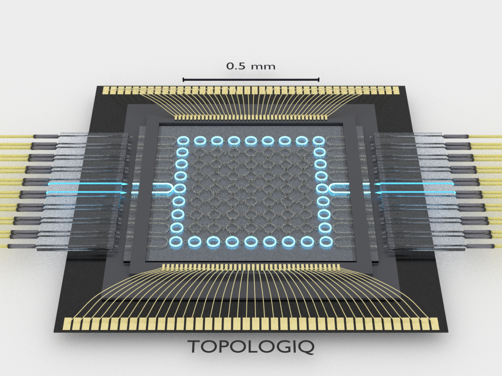
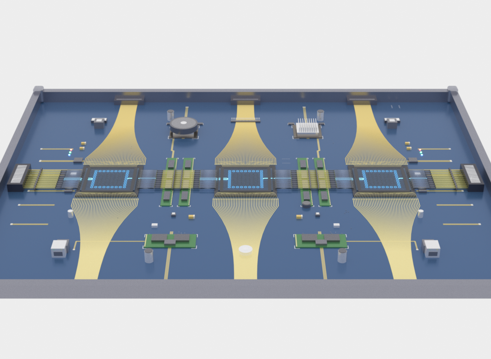

We welcome inquiries from prospective PhD students, postdoctoral researchers, visiting scientists, interns, and UMD undergraduates. Send a CV and a short description of your interests to **mhafezilabs [at] gmail.com**.

## PhD projects

- **Programmable photonics for optical computing:** device design, reconfigurable circuits, and linear or nonlinear photonic processors.
- **Ultrafast electro-optics:** high-speed modulators, RF–photonic co-design, and optical signal processing.
- **Inverse photonic design:** simulation, optimization, and machine learning for large programmable circuits.

## Postdoctoral projects

- **Nonlinear photonic engines:** experimental nonlinear kernels and reconfigurable processor architectures.
- **Photonic chip design:** PDK-based layout, multiphysics modeling, control circuitry, and foundry tape-outs.
- **Optical neural networks:** hardware–algorithm co-design and comparison with electronic systems.

## Other opportunities

- **Visiting scientists:** collaborative work in programmable photonics, electro-optics, or system integration.
- **Interns:** device simulation, experimental characterization, data acquisition, and analysis.
- **UMD undergraduates:** photonic layout, simulation, scripting, and design optimization.
