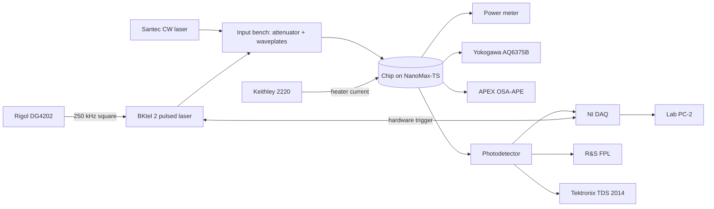

The primary fiber-to-chip measurement setup: Santec CW and BKtel pulsed sources through the input-conditioning bench, NanoMax-TS flexure stages for coupling, Navitar imaging column, and the OSA / ESA / scope detection chain.

## Equipment

- [[equipment/santec-tsl|Santec tunable CW laser]]
- [[equipment/bktel-2|BKtel 2 pulsed fiber laser]]
- [[equipment/rigol-dg4202|Rigol DG4202 function generator]]
- [[equipment/attenuator-wheel|Motorized attenuator wheel]]
- [[equipment/thorlabs-nanomax-ts|Thorlabs NanoMax-TS 3-axis flexure stage]]
- [[equipment/newport-micrometer-stages|Newport micrometer stages]]
- [[equipment/navitar-12x|Navitar 12x zoom microscope column]]
- [[equipment/amscope-camera|AmScope camera]]
- [[equipment/thorlabs-cs165cu|Thorlabs CS165CU Zelux camera]]
- [[equipment/keithley-2220-30-1|Keithley 2220-30-1 dual-channel power supply]]
- [[equipment/power-meter|Optical power meter]]
- [[equipment/yokogawa-aq6375b|Yokogawa AQ6375B optical spectrum analyzer]]
- [[equipment/apex-osa-ape|APEX OSA-APE high-resolution OSA]]
- [[equipment/ni-daq|NI DAQ]]
- [[equipment/tektronix-tds2014|Tektronix TDS 2014 oscilloscope]]
- [[equipment/rs-fpl|Rohde & Schwarz FPL spectrum analyzer]]
- [[equipment/usb-serial-hub|USB / serial hub]]

## Signal and trigger graph

> [!warning] Needs verification
> Setup membership was inferred from the September 3, 2026 walkthrough. Owners: please correct the equipment list, room, and graph.
