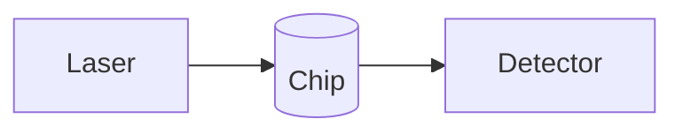

<%*
const title = await tp.system.prompt("Setup name");
const id = title.toLowerCase().replace(/[^a-z0-9]+/g, "-").replace(/(^-|-$)/g, "");
await tp.file.rename(id);
-%>
---
title: "<% title %>"
type: setup
id: <% id %>
room: TBD
owner: TBD
equipment: []
tags: [setup, setup/<% id %>]
---

What this setup measures.

## Equipment

## Signal and trigger graph

